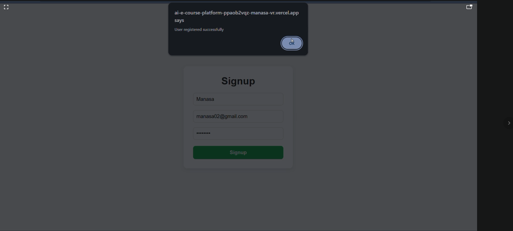
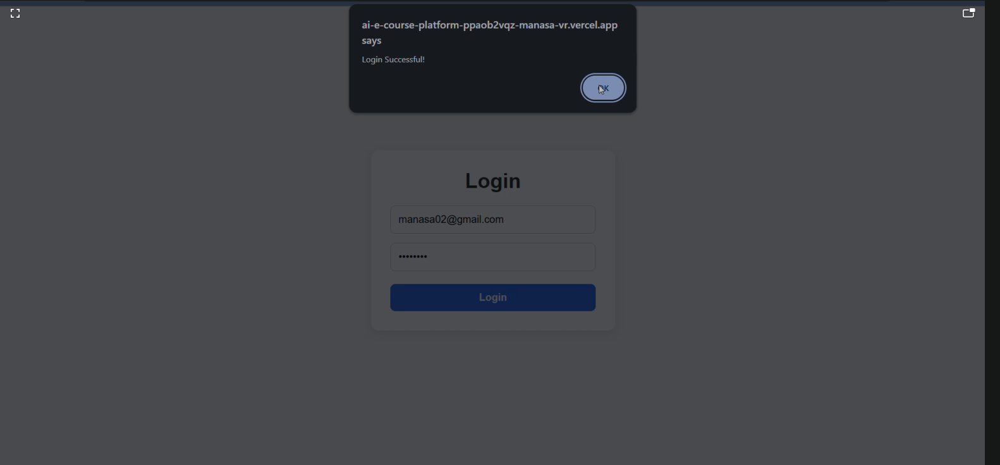
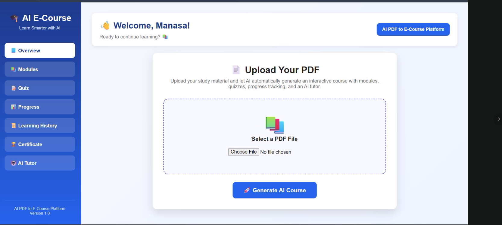
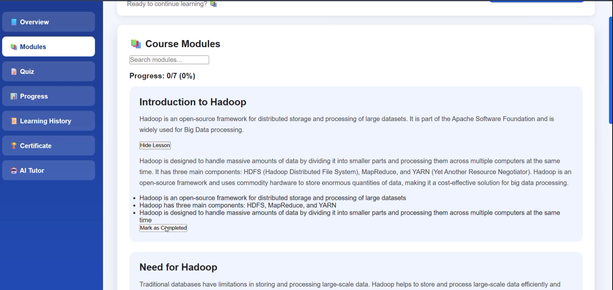
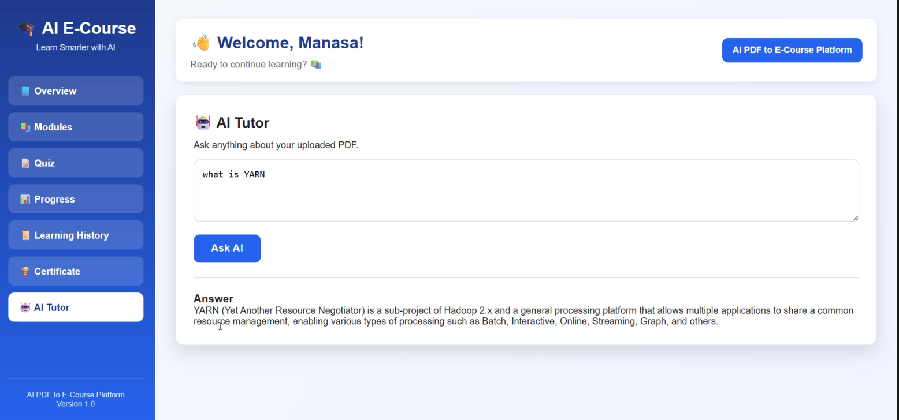
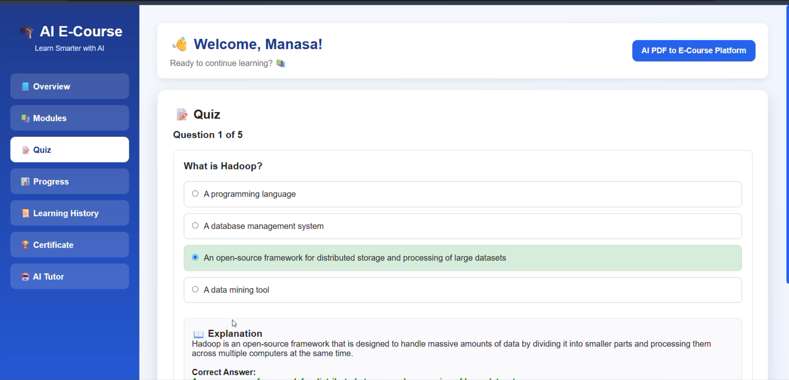
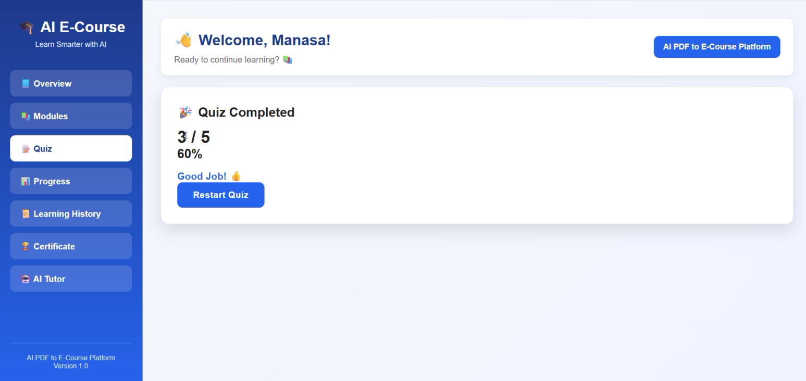
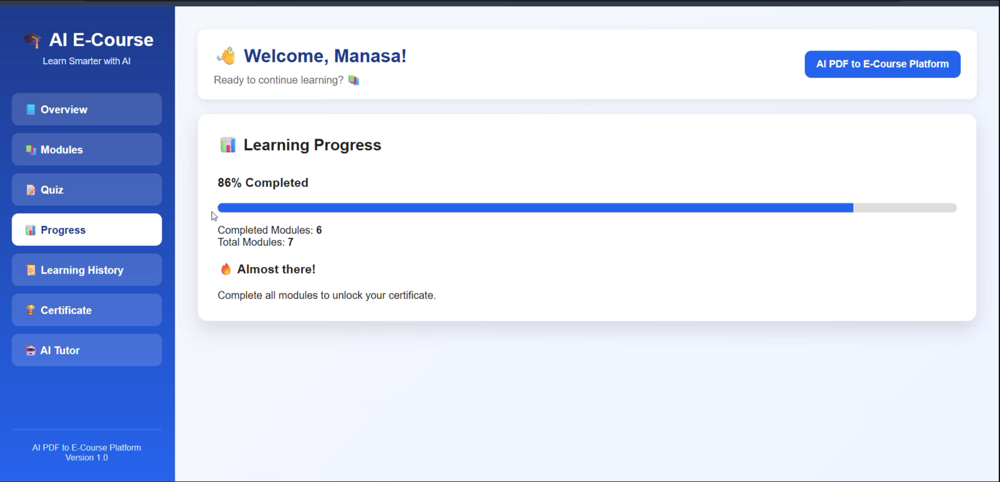
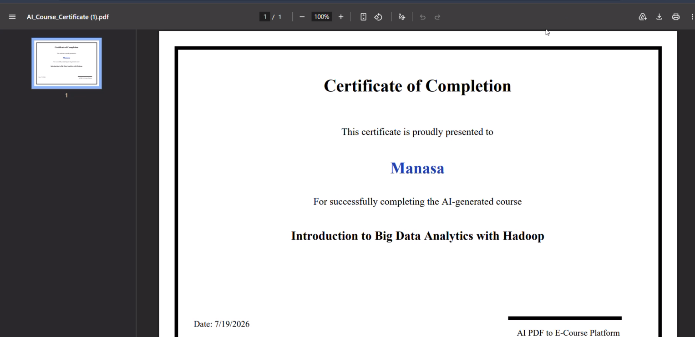
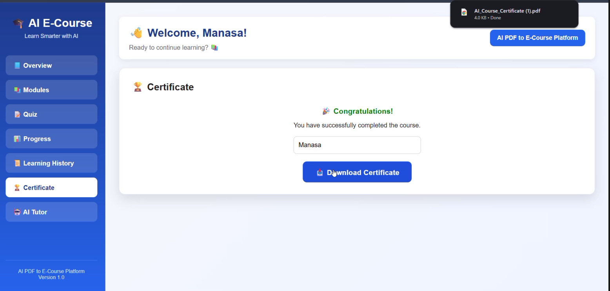

# 📚 AI-ECourse-Platform

An AI-powered web application that transforms PDF documents into interactive learning courses. Users can upload study materials, books, or documentation, and the system automatically generates structured lessons, quizzes, and an AI tutor to make learning easier.

This project was developed as part of the **In2Peta Generative AI Internship Assignment**.

---

## 🔗 Live Demo

- **Frontend:** [AI-ECourse-Platform](https://ai-e-course-platform.vercel.app/)
- **Backend API:** [FastAPI Backend](https://ai-ecourse-backend.onrender.com)

---

## ✨ Features

- 🔐 User Authentication (Register & Login)
- 📄 Upload PDF documents
- 🤖 AI-generated course from uploaded PDFs
- 📚 Structured modules and lessons
- 🧠 AI Tutor for asking questions from the uploaded PDF
- 📝 Automatically generated quizzes
- 📊 Learning progress tracking
- 🕒 Learning history
- 🏆 Course completion certificate
- 📱 Responsive user interface

---

## 🛠 Tech Stack

### Frontend
- Next.js
- React
- CSS

### Backend
- FastAPI
- Python

### Database
- SQLite
- SQLAlchemy

### AI & NLP
- Groq API (Llama 3)
- FAISS (Vector Database)
- PyMuPDF (PDF Text Extraction)

### Deployment
- Frontend: Vercel
- Backend: Render

---

## 📂 Project Structure

```
AI-ECourse-Platform/
│
├── frontend/
│   ├── app/
│   ├── components/
│   ├── public/
│   └── ...
│
├── backend/
│   ├── app/
│   │   ├── api/
│   │   ├── models/
│   │   ├── services/
│   │   ├── utils/
│   │   └── ...
│   ├── requirements.txt
│   └── main.py
│
├── screenshots/
│
└── README.md
```

---

## 🚀 How It Works

1. Create an account or log in.
2. Upload a PDF document.
3. The backend extracts the text from the PDF.
4. AI generates a structured learning course.
5. Study the generated lessons.
6. Ask questions to the AI Tutor.
7. Take quizzes to test your understanding.
8. Track your learning progress.
9. Download your completion certificate.

---

## ⚙️ Installation

### Clone the repository

```bash
git clone https://github.com/Manasavr05/AI-ECourse-Platform.git
```

---

### Backend Setup

```bash
cd backend

python -m venv venv

# Windows
venv\Scripts\activate

# Install dependencies
pip install -r requirements.txt

uvicorn main:app --reload
```

Backend runs on:

```
http://localhost:8000
```

---

### Frontend Setup

```bash
cd frontend

npm install

npm run dev
```

Frontend runs on:

```
http://localhost:3000
```

---

## 🔑 Environment Variables

Create a `.env` file inside the backend folder.

```env
GROQ_API_KEY=your_api_key
SECRET_KEY=your_secret_key
ALGORITHM=HS256
ACCESS_TOKEN_EXPIRE_MINUTES=30
```

---

## 📸 Screenshots

### Signup


### Login


### Dashboard


### PDF Upload


### AI Generated Course


### AI Tutor


### Quiz


### Quiz Result


### Learning Progress


### Certificate


### Certificate Details


---

## 📌 Future Improvements

- Google OAuth
- GitHub OAuth
- Dark Mode
- Flashcards
- Voice-based AI Tutor
- Multi-language Support
- Better Analytics Dashboard

---

## 👩‍💻 Author

**Manasa VR**

B.E. Cyber Security

---

## 📄 License

This project was developed for educational purposes as part of the **In2Peta Generative AI Internship Assignment**.